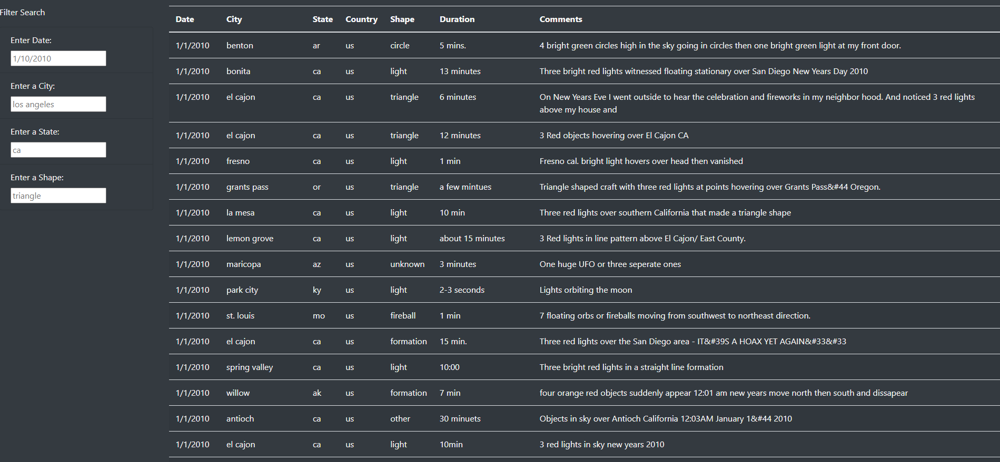
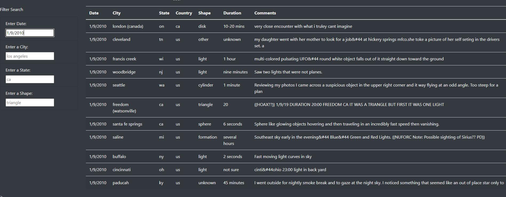
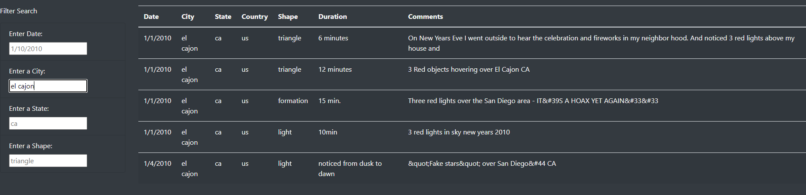
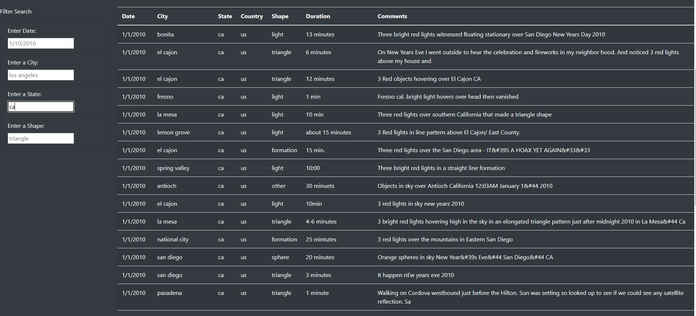
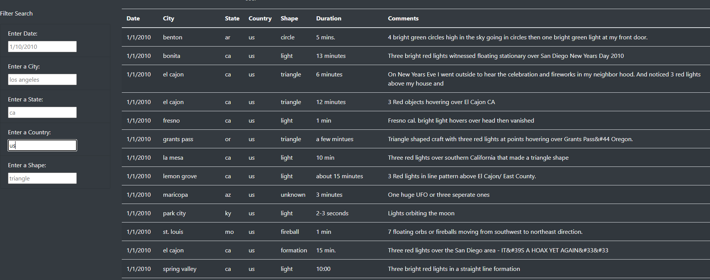
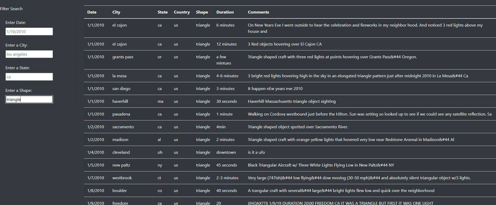
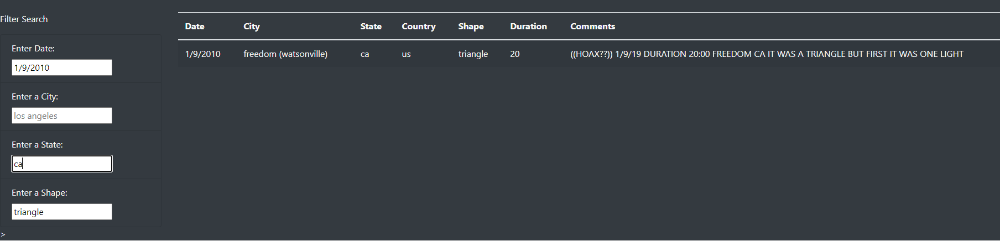
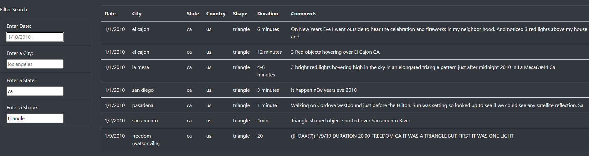

# UFOs
## Overview
### Purpose
Dana wants the table in her webpage about UFOs to have more functionality. The purpose is to add more filter options like filtering by city, state, country, and shape on top of the date option.

## Analysis
Unfiltered:

Filter By Date:

Filter by City:

Filter by State: 

Filter by Country:

Filter by Shape:

Using multiple filters:

removing a filter:

## Summary
The main drawback of this webpage is that the only info it produces are UFO sightings from a predefined file, so it won't update automatically.
it may be a good idea to implement some form of scrapping so the list of sightings increase as more arte found. adding a section for recent news articles related to UFO sightings may also improve the amount of information this webpage can give.
